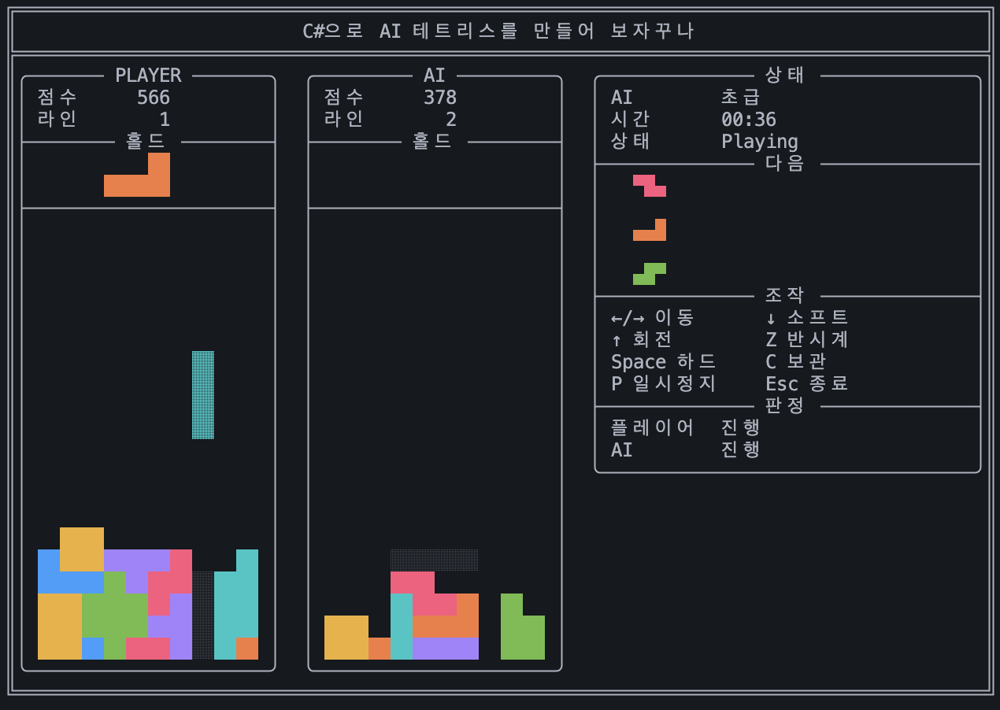

# C#으로 AI 테트리스를 만들어 보자꾸나



Raw `System.Console` 기반의 크로스 플랫폼 TUI 테트리스 대결 게임입니다. 플레이어와 작은 인공신경망 AI가 같은 7-bag 조각 순서로 동시에 플레이하고, 점수와 생존 결과로 승패를 냅니다.
시드는 매 경기 자동으로 랜덤 생성됩니다.

## Requirements

- .NET 10 SDK
- Windows Terminal, macOS Terminal, iTerm2, GNOME Terminal 등 일반 ANSI/UTF-8 터미널

## Run

```bash
dotnet run --project src/AiTetris
```

기본 렌더링은 컬러 유니코드 블록, 하프블록(`▀`, `▄`, `█`), 박스 드로잉 문자입니다. 최소 권장 크기는 83x24이며, 터미널이 충분히 크면 풀사이즈 보드로 자동 전환됩니다. 게임 화면은 별도 터미널 화면 버퍼와 synchronized update로 실행되어 스크롤백에 프레임이 쌓이지 않고 깜빡임을 줄입니다.

렌더 스타일은 `AI_TETRIS_RENDER_STYLE=color|safe|mono`로 강제할 수 있습니다. macOS 기본 Terminal은 배경색이 섞인 하프블록 렌더링이 깨질 수 있어 `safe` 스타일을 자동 사용합니다. 색상을 끄려면 `NO_COLOR=1`을 설정하세요.

## Test

```bash
dotnet test
```

## Controls

- Left/Right: move
- Down: soft drop
- Up: clockwise rotate
- Z: counter-clockwise rotate
- Space: hard drop
- C: hold
- P: pause
- Esc: quit

## AI

AI는 `6 input -> 4 tanh hidden -> 1 output` feed-forward 신경망과 전략 점수를 함께 사용해 가능한 착지 후보를 평가합니다. 구멍, 높이, 울퉁불퉁함을 강하게 벌점 처리하고 라인 클리어를 보상합니다. 난이도는 초급, 중급, 고급 세 단계이며 hold, lookahead, 실수율, 생각 시간이 다릅니다.

AI는 최종 위치로 순간이동하지 않고 회전, 좌우 이동, 낙하 명령을 순서대로 실행합니다. 초급은 하드드롭을 쓰지 않고 느리게 소프트드롭하므로 사람 플레이처럼 움직임이 보입니다.
